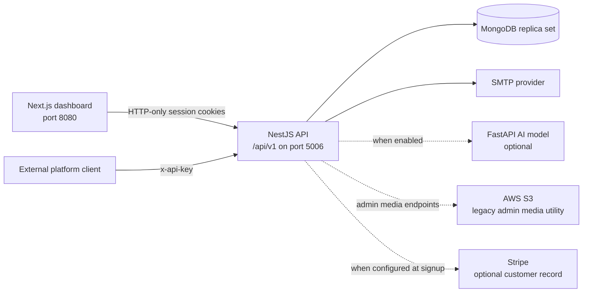
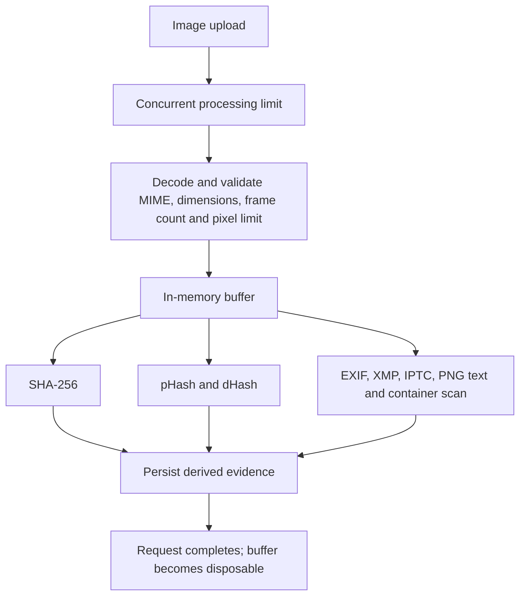
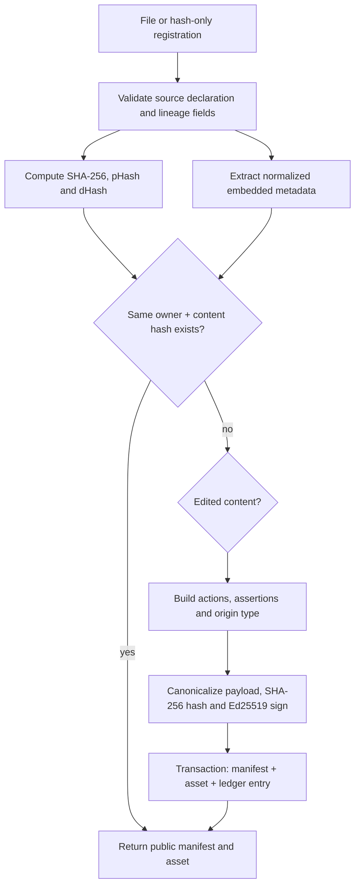
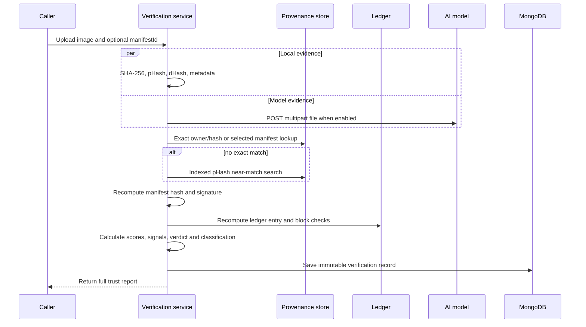

# ZTDPP System Architecture and End-to-End Flows

**Implementation reference:** current frontend and backend code as of 18 September 2026  
**System:** Zero Trust Digital Provenance Platform (ZTDPP)

This document explains what the implemented system does, how requests move through it, where information is stored, how image metadata is extracted, and how API responses are constructed. It describes the current code rather than the original proposal.

## 1. System purpose

ZTDPP records provenance claims for images and later evaluates uploaded copies against those claims. A registration creates:

- a cryptographic fingerprint of the image;
- a normalized metadata snapshot;
- a signed provenance manifest;
- an asset/version relationship;
- an entry in the platform-operated ZTD ledger.

A verification creates:

- fresh hashes and metadata from the submitted image;
- an exact or perceptual match result;
- signature and ledger integrity checks;
- an optional AI model result;
- an explainable trust score, verdict, classification, and signal list;
- an immutable verification report.

The system records a publisher's declaration and evidence around that declaration. It does not prove copyright ownership, physical camera possession, or the truth of a declared source by itself.

## 2. Runtime architecture



### Frontend

- Next.js 15 application in `ZTDPP`.
- Uses Redux Toolkit for client state and Axios for API calls.
- Sends cookies with every API request and adds `X-Requested-With: XMLHttpRequest`.
- User pages are under `/(app)`; administrator pages are under `/admin/(console)`.

### Backend

- NestJS API in `ZTDPP-Backend/Backend`.
- Uses Mongoose with MongoDB.
- Requires a transaction-capable MongoDB replica set for multi-document integrity.
- Uses a global validation pipe, exception filter, request logger, shared rate limiter, CORS, and origin validation.

### Primary access modes

| Access mode | Authentication | Used by |
| --- | --- | --- |
| Dashboard | Short-lived access cookie plus rotating refresh cookie | Browser users and administrators |
| Integration API | `x-api-key` or `Authorization: Bearer ztd_...` | External publishing or verification systems |

## 3. Data storage map

All primary application records are stored in MongoDB unless stated otherwise.

| Collection or location | What is stored | Important behavior |
| --- | --- | --- |
| `users` | Profile, email, bcrypt password hash, role reference, status, Stripe customer ID, session version, temporary OTP state | Password and OTP fields are excluded from ordinary queries |
| `roles` | Role name, permissions, default flag | Seeded with required roles |
| `auth_sessions` | Session ID, user ID, SHA-256 refresh-token hash, expiry, revoked flag | TTL index removes expired records; plaintext refresh tokens are not stored |
| `api_keys` | Name, owner, prefix, SHA-256 peppered key hash, masked display value, scopes, rate limit, expiry and status | Full key is returned once and never stored |
| `api_usage` | Daily counters per API key, event, and owner | Records counts and error counts |
| `assets` | One logical content lineage: owner, root/current manifest, origin, latest/root hashes, version and verification counts | One asset connects the original and all edits |
| `manifests` | One provenance claim per content version, hashes, normalized metadata, actions, assertions, signature and ledger reference | Unique per owner and content hash; version is unique within an asset |
| `verifications` | Immutable report input facts, scores, signals, AI result, evidence snapshots, and integrity checks | Uploaded image bytes are not stored |
| `ledger_entries` | Sequence, manifest reference, hashes, previous-entry hash, status, block and Merkle proof | Append-only logical chain |
| `ledger_blocks` | Block index, previous block hash, Merkle root, nonce, difficulty, signature and signer key ID | Blocks are Ed25519 signed |
| `counters` | Atomic numeric counters | Supplies ledger sequence numbers |
| `platform_settings` | Trust weights, thresholds, model, ledger, API-key and verification settings | Database values override environment defaults; cached for 30 seconds |
| `transaction_locks` | Revision counters for serialized transactional resources | Coordinates ledger and per-owner API-key writes across instances |
| `rate_limit_windows` | Hashed fixed-window counters and expiry | Shared across instances; TTL cleanup |
| `security_audit` | Administrative mutation attempts and outcomes | Does not store bodies, credentials, cookies, or uploaded content |
| `contacts` | Contact form name, email, phone, subject, message, and status | General CRUD module |
| `logs` | Application error/info/debug records | Server failures are logged without request secrets |
| Browser local storage | Persisted Redux user summary, authenticated flag, recovery email and OTP-flow type | Access token and recovery code are deliberately excluded |
| Browser cookies | HTTP-only access/refresh tokens from the API; readable role-routing cookie from the frontend | Auth cookies are `Secure` in production and `SameSite=Lax` |
| SMTP provider | Outgoing verification and recovery emails | OTP code is sent here; only its keyed hash is stored in MongoDB |
| AWS S3 | Files uploaded through administrator-only media utilities | Not used by provenance registration or verification |

## 4. What happens to an uploaded image

The main provenance and verification endpoints use Multer memory storage. The image exists as a memory buffer for the duration of the request.



Controls applied before business logic:

1. The account receives a shared upload quota check.
2. The process enforces a configurable concurrent-image limit.
3. Sharp identifies the actual decoded format and compares it with the claimed MIME type.
4. Multi-frame images, malformed/truncated files, missing dimensions, and files over the pixel budget are rejected.
5. A bounded full decode verifies that the file is actually processable.
6. The endpoint-specific maximum file size is enforced.

**Persisted:** hashes, file name, MIME type, byte size, dimensions, normalized metadata and derived evidence.  
**Not persisted by these flows:** original image bytes or an image object-storage key.

## 5. Metadata extraction and return flow

### 5.1 Extraction

`MetadataExtractorService` runs Sharp and `exifr` in parallel.

| Source | Extracted values |
| --- | --- |
| Image decoder | Format, width, height |
| EXIF/IFD | Make, model, software, lens, capture/create/modify dates, exposure, aperture, ISO, focal length, orientation, dimensions, GPS-presence boolean, color space |
| XMP | Creator tool, IPTC digital source type, dates, document ID, instance ID, up to 20 history records |
| IPTC | Credit and digital source type |
| PNG chunks | Bounded `tEXt` and `iTXt` key/value data used for generator hints |
| Container scan | Presence of JPEG JUMBF, PNG `caBX`, or WebP `C2PA` container markers |

GPS coordinates are not returned; only `hasGps` is recorded.

### 5.2 AI-generator hints from metadata

The extractor searches software, creator-tool, history, source-type, and PNG text fields for known generator patterns. It can identify indicators for tools such as Midjourney, DALL-E, Stable Diffusion, Firefly, Imagen, Gemini, OpenAI, Runway, Leonardo, Ideogram, Flux, ComfyUI, AUTOMATIC1111, InvokeAI, NovelAI, Bing Image Creator, and Canva AI.

These hints are heuristic evidence. They do not call the deepfake model and do not independently prove an image was AI-generated.

### 5.3 Stored metadata shape

Registration stores a compact snapshot on the manifest:

```json
{
  "format": "jpeg",
  "width": 1920,
  "height": 1080,
  "exif": {
    "present": true,
    "make": "Example Camera Co.",
    "model": "Example Model",
    "software": "Camera Firmware",
    "dateTimeOriginal": "2026-09-18T10:15:00.000Z",
    "hasGps": false
  },
  "xmp": {
    "present": false
  },
  "iptc": {
    "present": false
  },
  "c2pa": {
    "containerPresent": false
  },
  "aiHints": {
    "detected": false,
    "indicators": []
  }
}
```

Verification stores and returns a fresh compact snapshot under `embeddedMetadata`. Registration returns its snapshot as `manifest.embeddedMetadata` to the owning account.

For another account's matched claim, the response uses a limited public summary. Private embedded metadata, publisher email, API-key details, actions, and custom metadata are removed.

## 6. Account and session flows

### 6.1 Account registration

```mermaid
sequenceDiagram
    participant U as User
    participant F as Frontend
    participant A as Auth API
    participant D as MongoDB
    participant S as SMTP

    U->>F: Submit registration
    F->>A: POST /auth/signup
    A->>D: Check normalized email
    A->>D: Load user role
    A->>D: Create pending user with bcrypt hash
    A->>D: Store HMAC-hashed OTP, purpose and expiry
    A->>S: Email six-digit code
    A-->>F: Account created message
    U->>F: Enter code
    F->>A: POST /auth/verify-email
    A->>D: Atomically consume OTP and activate user
    A->>D: Create auth session
    A-->>F: Set access and refresh cookies; return public user
```

- OTP lifetime: 10 minutes.
- Maximum failed attempts: 5.
- Resend cooldown: 2 minutes.
- OTP values are HMAC-SHA-256 hashed with the server JWT secret before storage.
- Successful email verification atomically removes the OTP and changes status to active.

### 6.2 Login

1. The API normalizes the email and loads the password hash and role.
2. bcrypt compares the submitted password with the stored hash.
3. The endpoint enforces the required role (`user` or `super-admin`) and active status.
4. A random session ID is created in `auth_sessions`.
5. The refresh token is hashed before database storage.
6. Access and refresh JWTs are returned only as HTTP-only cookies.
7. The response body contains a sanitized user without password, OTP, session version, or internal session data.

### 6.3 Refresh and logout

- Refresh validates the refresh JWT, session ID, session version, expiry, and stored refresh hash.
- Every refresh rotates the refresh token and replaces its stored hash.
- Reuse of an old refresh token revokes the session.
- Logout marks the session revoked and clears both auth cookies.
- Password changes increment `sessionVersion`, invalidating all previously issued tokens.

### 6.4 Password recovery

1. `POST /auth/forgotPassword` always returns a neutral message to prevent account discovery.
2. An eligible account receives a recovery OTP by email.
3. `POST /auth/validate-otp` consumes the OTP and returns a random one-time reset token.
4. Only the reset token's HMAC hash is stored, with a new 10-minute expiry.
5. `PATCH /auth/resetPassword` atomically consumes that token, writes a bcrypt password hash, increments the session version, and removes recovery state.

## 7. API-key lifecycle

### Creation

1. A signed-in user submits a name, optional description, scopes, rate limit, and expiry.
2. Platform allowances are loaded from settings.
3. A per-owner MongoDB transaction lock serializes creation and checks the active-key maximum.
4. The server creates a random key containing the configured environment tag.
5. The response returns `plaintextKey` exactly once.
6. MongoDB stores only the searchable prefix, masked value, and SHA-256 hash made with `API_KEY_PEPPER`.

### Authentication of integration calls

1. `ApiKeyGuard` extracts the key from `x-api-key` or a `Bearer ztd_...` header.
2. The prefix narrows candidate records.
3. A timing-safe comparison checks the full peppered hash.
4. The guard rejects revoked, expired, or inactive-owner keys.
5. Required endpoint scopes are enforced.
6. A shared per-key rate limit is consumed and returned through `X-RateLimit-*` headers.
7. Daily usage is updated asynchronously.

Rotation revokes the old key and creates a replacement with equivalent settings. Revocation keeps the historical record but prevents further use.

## 8. Content registration flow

Registration is available through:

- dashboard: `POST /assets/register` with session authentication;
- integration: `POST /provenance/register` with `provenance:write` scope;
- integration edits: `POST /provenance/edit` with `provenance:write` scope.



### Fingerprints

- `contentHash`: SHA-256 of exact file bytes. Any byte change produces a different value.
- `phash`: 64-bit DCT perceptual hash for visual similarity.
- `dhash`: 64-bit difference hash retained as secondary evidence.
- `phashBands`: eight indexed bands used to find near-match candidates efficiently.

Hash-only integration registration accepts `contentHash` and `mimeType`, but it cannot accept a caller-supplied pHash. It records `hashOnly: true` and has no extracted image metadata.

### Manifest construction

Each manifest receives unique `urn:ztdpp:manifest:<uuid>` and `urn:ztdpp:asset:<uuid>` identifiers. The signed payload contains:

- manifest and asset IDs;
- version and parent references;
- content and perceptual hashes;
- MIME type;
- declared and derived origin;
- actions and assertions;
- claim generator details;
- bounded custom metadata;
- registration timestamp;
- `spec: ztdpp-manifest/1.0`.

The server canonicalizes this object, hashes it with SHA-256, and signs the resulting manifest hash with Ed25519. The manifest stores the signature, key ID, and signing time.

### Assertions returned in the manifest

Depending on the request, the manifest may contain:

- `c2pa.hash.data`: SHA-256 hash, algorithm and MIME type;
- `ztdpp.hash.perceptual`: server-computed pHash;
- `ztdpp.origin`: normalized origin type and IPTC digital-source URI;
- `c2pa.ingredient`: parent claim for an edited version;
- `ztdpp.ai_generation`: declared model/provider/version information;
- `ztdpp.capture`: declared device/software/time information;
- `stds.exif`: normalized EXIF snapshot;
- `ztdpp.dimensions`: decoded dimensions.

These are C2PA-style custom manifests. Detection of an external C2PA container does not validate the external issuer's C2PA signature.

### Registration response

The response returns both the content version and its lineage summary:

```json
{
  "data": {
    "alreadyRegistered": false,
    "manifest": {
      "manifestId": "urn:ztdpp:manifest:<uuid>",
      "assetId": "urn:ztdpp:asset:<uuid>",
      "version": 1,
      "contentHash": "<sha256>",
      "phash": "<64-bit hex>",
      "dhash": "<64-bit hex>",
      "originType": "camera",
      "originAssurance": "self-declared",
      "actions": [],
      "assertions": [],
      "embeddedMetadata": {},
      "manifestHash": "<sha256 of canonical claim>",
      "signature": { "alg": "ed25519", "keyId": "<key id>", "value": "<signature>" },
      "ledger": { "seq": 1, "entryHash": "<hash>", "status": "pending" },
      "status": "active"
    },
    "asset": {
      "assetId": "urn:ztdpp:asset:<uuid>",
      "rootOriginType": "camera",
      "currentOriginType": "camera",
      "rootContentHash": "<sha256>",
      "latestContentHash": "<sha256>",
      "versionCount": 1,
      "verificationCount": 0
    }
  }
}
```

The actual response also includes MIME type, dimensions, file size, timestamps, claim generator, parent references, custom metadata and any revocation data. A repeated registration by the same owner returns the existing manifest with `alreadyRegistered: true`.

### Edited content and lineage

- An edit must specify a parent manifest or parent content hash.
- The parent must belong to the same account.
- The parent must be the asset's current version and must not be revoked.
- The new manifest links to the parent and increments the asset version.
- AI edit actions propagate an AI-generated-edited origin through the lineage.

### Transaction behavior

Manifest creation, asset creation/update, and ledger append execute inside a MongoDB transaction serialized on the `ledger` lock. A failure rolls the operation back rather than leaving a partial manifest or asset.

## 9. Manifest revocation

Revocation preserves history:

1. The owner submits a reason.
2. The server verifies ownership and returns the existing state if already revoked.
3. It builds a separate revocation event containing the target manifest hash and timestamp.
4. The event is hashed and signed.
5. A new ledger entry anchors the revocation event.
6. The manifest status changes to `revoked` and stores the signed revocation record.

The original signed manifest remains available. Future verification treats the revoked manifest signature result as invalid for trust scoring and reports the current manifest status separately.

## 10. Ledger flow

### Entry append

For every manifest or revocation event:

```text
entryHash = SHA-256(
  sequence | manifestId | manifestHash | contentHash |
  previousEntryHash | timestamp
)
```

The entry starts as `pending`. Its sequence comes from an atomic counter and its `prevEntryHash` links it to the previous entry.

### Block sealing

A scheduled task runs every 10 seconds and seals when either:

- pending entries reach `blockSize`; or
- `blockIntervalSeconds` has elapsed.

The sealer:

1. Loads pending entries in sequence order.
2. Builds a Merkle tree from their entry hashes.
3. Links the block to the previous block.
4. Searches for a nonce satisfying the configured leading-zero difficulty, with a 10-second CPU budget.
5. Signs the block hash with Ed25519.
6. Stores each entry's block reference, leaf index, and Merkle inclusion proof.

### Verification

Ledger verification recomputes:

- entry hash;
- entry-to-entry link;
- Merkle proof;
- block hash;
- block-to-block link;
- proof-of-work target;
- Ed25519 block signature using the recorded key ID.

The proof endpoint returns the receipt, public block, verification checks, current public key, and historical public-key set.

## 11. Image verification flow

Verification is available through:

- dashboard: `POST /verifications` with session authentication;
- integration: `POST /verify` with `verify` API-key scope.



### Match selection

1. If `manifestId` is supplied, it must refer to a manifest whose exact content hash matches the uploaded file.
2. Otherwise the service first looks for the requester's own exact claim.
3. If none exists, it checks all exact claims for that hash.
4. Multiple exact claims require the caller to choose a `manifestId`.
5. With no exact claim, pHash bands produce near-match candidates.
6. Candidates are filtered by exact 64-bit Hamming distance.
7. More than 5,000 candidates fails explicitly; equally close best matches are treated as ambiguous.

### Metadata score

The metadata/provenance score is out of 100:

| Component | Maximum | Main inputs |
| --- | ---: | --- |
| Provenance match | 40 | Exact SHA-256 or near pHash match |
| Manifest signature | 15 | Recomputed canonical manifest hash and Ed25519 signature |
| Ledger anchoring | 15 | Entry chain, Merkle proof, block hash, signature and difficulty |
| Origin trust | 15 | Declared origin, lineage, metadata hints |
| Metadata integrity | 15 | Exact bytes or EXIF consistency against the registration snapshot |

An invalid signature caps this score at 25. A failed ledger check caps it at 30.

### AI score and fallback

When enabled, the backend sends the in-memory image to the configured FastAPI `/predict` endpoint. It accepts several common classifier response shapes and normalizes them into:

- `label`;
- `fakeProbability`;
- `realProbability`;
- `confidence`;
- optional `modelVersion`;
- `latencyMs` and status.

The AI score measures consistency with the declared origin rather than simply rewarding “real”:

- no claim or camera/edited declaration: `(1 - P(fake)) × 100`;
- declared AI generation: `60 + 40 × P(fake)`;
- digital creation: `50 + 50 × (1 - P(fake))`.

Three consecutive model failures open a 30-second circuit breaker. If the model is disabled or unavailable, `aiScore` is `null`, effective AI weight becomes 0, and metadata receives 100% of the effective weight. The report explicitly includes an `ai_analysis_disabled` or `ai_analysis_unavailable` signal.

### Final score and verdict

With the default policy:

```text
trustScore = metadataScore × 0.60 + aiScore × 0.40
```

Default thresholds:

| Score | Verdict |
| ---: | --- |
| 80-100 | `trusted` |
| 60-79 | `likely_authentic` |
| 40-59 | `suspicious` |
| 0-39 | `untrusted` |

A broken signature, broken ledger proof, or critical model/declaration conflict can cap the verdict at suspicious even when the numeric score is higher.

Classification comes from the matched manifest when one exists (`classificationBasis: declared`). Without a manifest, metadata and model evidence infer camera-captured, edited, AI-generated, or unknown (`classificationBasis: inferred`).

## 12. Verification response and metadata return

Successful APIs use a `{ "data": ... }` envelope. A verification's `data` contains:

```json
{
  "verificationId": "urn:ztdpp:verification:<uuid>",
  "createdAt": "<UTC timestamp>",
  "source": "dashboard",
  "trustScore": 84,
  "verdict": "trusted",
  "verdictLabel": "Trusted",
  "classification": "camera_captured",
  "classificationLabel": "Camera captured",
  "classificationBasis": "declared",
  "policy": {
    "version": "1.0",
    "trustWeights": { "metadata": 60, "ai": 40 },
    "verdictThresholds": { "trusted": 80, "likelyAuthentic": 60, "suspicious": 40 },
    "phashDistanceThreshold": 10
  },
  "scores": {
    "metadata": { "score": 92, "weight": 60, "effectiveWeight": 60, "max": 100 },
    "ai": { "score": 72, "weight": 40, "effectiveWeight": 40, "max": 100 }
  },
  "metadataBreakdown": [],
  "signals": [],
  "ai": {},
  "input": {
    "contentHash": "<sha256>",
    "phash": "<64-bit hex>",
    "mimeType": "image/jpeg",
    "fileSize": 123456,
    "fileName": "example.jpg",
    "width": 1920,
    "height": 1080
  },
  "provenance": {
    "match": "exact",
    "currentManifestStatus": "active",
    "phashDistance": 0,
    "manifest": {}
  },
  "checks": {
    "signature": {},
    "ledger": {}
  },
  "embeddedMetadata": {},
  "processingMs": 243
}
```

The example values are illustrative. The persisted policy and manifest snapshots ensure that a historical report continues to explain the evidence and settings used when it was produced.

## 13. Frontend flows

| Page | Purpose and backend calls |
| --- | --- |
| `/login` | User login through `auth/user/login` |
| `/register` | Account creation through `auth/signup` |
| `/verify-otp` | Email verification or recovery-code validation; supports resend |
| `/forgot-password` | Starts neutral account recovery |
| `/reset-password` | Consumes reset token and changes password |
| `/dashboard` | Loads keys, assets, verifications and 30-day usage in parallel |
| `/verify` | Uploads an image, renders the trust report, then optionally loads matched asset history |
| `/verifications` | Paginated/filterable report history |
| `/verifications/[id]` | Full saved verification report and matched lineage |
| `/assets` | Paginated assets, origin filter, search and registration modal |
| `/assets/[id]` | Asset timeline and ledger proof access |
| `/assets/manifest/[manifestId]` | Manifest detail and owner revocation action |
| `/api-keys` | Create, reveal once, update, rotate, revoke and inspect usage |
| `/docs` | Integration examples for API-key clients |
| `/settings` | Profile and password management |
| `/admin/login` | Separate super-admin login |
| `/admin/dashboard` | Platform totals, distributions, usage, ledger state and model health |
| `/admin/users` | List accounts, change status and inspect per-user overview |
| `/admin/api-keys` | Platform key visibility and revocation |
| `/admin/assets` | Platform-wide asset browsing and lineage |
| `/admin/verifications` | Platform-wide verification reporting |
| `/admin/ledger` | Blocks, entries, public keys, full audit and manual seal |
| `/admin/settings` | Update scoring, model, ledger, API-key and verification policy |

The Axios wrapper converts the backend's error envelope to a user-facing message. On a 401 it performs one coordinated refresh attempt, retries the original request, and sends the user to the correct login page if refresh fails.

## 14. Administration and audit

All `/admin` routes require the `super-admin` role. Administrative capabilities include:

- system dashboard analytics;
- account state control;
- API-key review and revocation;
- platform-wide assets and verification reports;
- ledger inspection, audit, and manual sealing;
- live settings changes;
- AI service health checks.

Mutation interceptors record `attempted`, `succeeded`, or `failed` events with operation ID, actor ID, method, route, request ID, status, and route target IDs. A write does not begin if the initial audit record cannot be persisted.

## 15. API route catalog

All paths below are relative to `/api/v1`.

| Area | Method and path | Access | Result |
| --- | --- | --- | --- |
| System | `GET /live` | Public | Process liveness |
| System | `GET /ready` | Public | Database and signer readiness |
| System | `GET /health` | Public | Application health detail |
| Authentication | `POST /auth/signup` | Public, throttled | Creates pending user and sends OTP |
| Authentication | `POST /auth/user/login` | Public, throttled | Creates user session or resends verification OTP |
| Authentication | `POST /auth/admin/login` | Public, throttled | Creates super-admin session |
| Authentication | `POST /auth/verify-email` | Public, throttled | Consumes signup OTP and activates account |
| Authentication | `POST /auth/validate-otp` | Public, throttled | Consumes recovery OTP and returns reset token |
| Authentication | `POST /auth/forgotPassword` | Public, throttled | Starts neutral password recovery |
| Authentication | `PATCH /auth/resetPassword` | Public, throttled | Consumes reset token and changes password |
| Authentication | `PATCH /auth/resend-otp` | Public, throttled | Reissues an eligible OTP |
| Authentication | `PATCH /auth/update-password` | Session | Changes password and invalidates sessions |
| Authentication | `POST /auth/refresh-token` | Refresh cookie | Rotates refresh token and session expiry |
| Authentication | `POST /auth/logout` | Cookie if present | Revokes session and clears cookies |
| Users | `GET /users/me` | Session | Returns current public profile |
| Users | `PATCH /users/update-me` | Session | Updates current profile |
| Users | `GET /users` | Super-admin | Lists users |
| Users | `POST /users/create` | Super-admin | Creates a user |
| Users | `PATCH /users/update-user` | Super-admin | Updates a user |
| Users | `PATCH /users/active-inactive/:userId` | Super-admin | Toggles account status |
| API keys | `POST /api-keys` | Session | Creates key and reveals plaintext once |
| API keys | `GET /api-keys` | Session | Lists owned keys |
| API keys | `GET /api-keys/usage` | Session | Returns owner daily usage |
| API keys | `GET /api-keys/:id` | Session | Returns an owned sanitized key |
| API keys | `GET /api-keys/:id/usage` | Session | Returns usage for one key |
| API keys | `PATCH /api-keys/:id` | Session | Updates key policy |
| API keys | `POST /api-keys/:id/rotate` | Session | Revokes and replaces a key |
| API keys | `DELETE /api-keys/:id` | Session | Revokes a key |
| Dashboard assets | `GET /assets` | Session | Lists owned assets |
| Dashboard assets | `POST /assets/register` | Session | Registers uploaded content |
| Dashboard assets | `GET /assets/:id/history` | Session | Returns owned lineage |
| Dashboard assets | `GET /assets/manifest/:manifestId` | Session | Returns owned manifest |
| Dashboard assets | `POST /assets/manifest/:manifestId/revoke` | Session | Revokes owned manifest |
| Integration provenance | `POST /provenance/register` | API key: provenance write | Registers original content or a hash-only claim |
| Integration provenance | `POST /provenance/edit` | API key: provenance write | Registers a linked edit |
| Integration provenance | `GET /provenance/lookup` | API key: provenance read | Looks up hash, manifest, asset or external ID |
| Integration provenance | `GET /provenance/manifest/:manifestId` | API key: provenance read | Returns owned manifest and live ledger status |
| Integration provenance | `GET /provenance/history/:id` | API key: provenance read | Returns owned lineage |
| Integration provenance | `POST /provenance/manifest/:manifestId/revoke` | API key: provenance write | Revokes owned manifest |
| Dashboard verification | `POST /verifications` | Session | Verifies an image and saves report |
| Dashboard verification | `GET /verifications` | Session | Lists owned reports with filters |
| Dashboard verification | `GET /verifications/:verificationId` | Session | Returns owned report; admins may inspect all |
| Integration verification | `POST /verify` | API key: verify | Verifies an image and saves report |
| Integration verification | `GET /verify/:verificationId` | API key: verify | Returns the caller's saved report |
| Public ledger | `GET /ledger/stats` | Public | Chain statistics |
| Public ledger | `GET /ledger/public-key` | Public | Current and historical verification keys |
| Public ledger | `GET /ledger/blocks` | Public | Paginated blocks |
| Public ledger | `GET /ledger/blocks/:indexOrHash` | Public | Block, entries and recomputed checks |
| Public ledger | `GET /ledger/entries` | Public | Paginated entries and hash filter |
| Public ledger | `GET /ledger/proof/:manifestId` | Public | Inclusion proof and verification result |
| Public ledger | `GET /ledger/checkpoint` | Public | Signed current head reference |
| Public ledger | `GET /ledger/verify` | Public, strongly throttled | Recomputes a bounded section of the chain |
| Administration | `/admin/*` | Super-admin | Dashboard, user overview, keys, assets, reports, ledger actions, settings and model health |
| Media utility | `POST /media/upload` and `/media/upload-url` | Super-admin | Direct or presigned S3 upload |
| Contact | `POST /contact-us` | Public | Stores a contact request |
| Contact | Remaining `/contact-us` CRUD | Super-admin | Lists, updates or removes requests |
| Roles | `POST /roles` | **Currently unauthenticated** | Creates a role; this route should be removed or restricted before production |

The role-creation route is a current implementation risk. Normal deployment should create required roles through the idempotent seed/migration, not through a public mutation endpoint.

## 16. Response, error and observability conventions

Success:

```json
{ "data": {} }
```

Failure:

```json
{
  "status": "fail",
  "statusCode": 400,
  "message": { "error": ["Human-readable message"] },
  "requestId": "<server-generated UUID>"
}
```

Every request receives an `X-Request-Id`. HTTP logs include only request ID, method, matched route, status, and duration. They exclude query strings, bodies, cookies, authorization headers, and uploaded content. Expected client errors remain visible in request logs; server errors also go through application error logging.

Health endpoints:

- `GET /api/v1/live`: confirms the process responds.
- `GET /api/v1/ready`: requires writable, transaction-capable MongoDB and an initialized signing key.
- `GET /api/v1/health`: returns broader health information.

## 17. Security boundaries and current limitations

- The platform signs its own custom provenance manifest; it is not full C2PA interoperability.
- External C2PA container presence is detected but its external signature chain is not validated.
- Camera origin is self-declared. Hardware attestation validation is rejected because it is not implemented.
- The ZTD ledger is platform-operated. It is hash chained and signed, but it is not a public decentralized blockchain.
- An independently stored checkpoint is still needed to detect database rollback or complete truncation by a privileged attacker.
- A pHash near match means visual similarity, not proof that one file was derived from another.
- Metadata can be absent, stripped, rewritten, or fabricated; the score explains this uncertainty rather than treating metadata as unquestionable truth.
- The optional AI result is probabilistic and can fail, time out, or disagree with a declaration.
- S3 uploads are a separate administrator media utility and do not change the no-image-retention behavior of provenance registration and verification.

## 18. Source-code map

Frontend paths are relative to `ZTDPP`; backend paths are relative to `ZTDPP-Backend/Backend`.

| Concern | Repository | Main implementation |
| --- | --- | --- |
| Frontend API client | Frontend | `src/interceptor/useAxios.js` |
| Frontend auth persistence | Frontend | `src/store/index.js`, `src/store/auth/authSlice.js` |
| Authentication | Backend | `src/resources/users/auth` |
| Users and roles | Backend | `src/resources/users/user`, `src/resources/users/role` |
| API keys | Backend | `src/resources/api-keys` |
| Provenance and assets | Backend | `src/resources/provenance` |
| Verification orchestration | Backend | `src/resources/verification/verification.service.ts` |
| Trust scoring | Backend | `src/resources/verification/trust-engine.service.ts` |
| Metadata extraction | Backend | `src/shared/metadata-extractor.service.ts` |
| Perceptual hashes | Backend | `src/shared/image-hash.service.ts` |
| AI client | Backend | `src/shared/ai-detection.service.ts` |
| Ledger | Backend | `src/resources/ledger` |
| Cryptography | Backend | `src/shared/crypto.service.ts` |
| Platform settings | Backend | `src/resources/settings` |
| Admin console API | Backend | `src/resources/admin` |
| Request security | Backend | `src/common/middlewares/security.middleware.ts` |
| Upload validation | Backend | `src/common/interceptors/image-validation.interceptor.ts` |
| Audit trail | Backend | `src/shared/audit.service.ts`, `src/common/interceptors/audit.interceptor.ts` |
